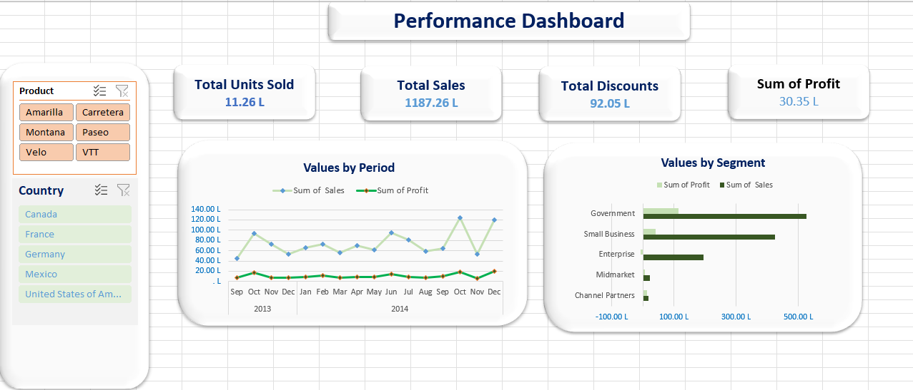

# Customer Sales Performance Dashboard

## 📊 Project Overview

This project is an Excel-based Business Analytics dashboard designed to analyze customer and sales performance. The dashboard transforms business data into an easy-to-understand visual report to support data-driven decision-making.

## 🎯 Business Objective

The main objective of this project is to analyze sales and customer data, identify important performance trends, and present the results through an interactive Excel dashboard.

## 🛠️ Tools Used

- Microsoft Excel
- Pivot Tables
- Excel Charts
- Data Analysis
- Data Visualization
- Dashboard Design

## 📈 Dashboard Preview

## 🔍 Analysis

The dashboard provides a consolidated view of customer and sales performance and helps identify trends and patterns within the available data.

The project includes:

- Customer performance analysis
- Sales performance analysis
- KPI-based reporting
- Pivot Table analysis
- Interactive visualizations
- Business-focused data presentation

## 💡 Business Value

The dashboard demonstrates how raw business data can be transformed into meaningful visual insights that can help stakeholders monitor performance and support better business decisions.

## 📚 Skills Demonstrated

- Business Analytics
- Microsoft Excel
- Data Analysis
- Data Visualization
- Pivot Table Analysis
- Dashboard Development
- Business Insight Generation
- Data-driven Decision Making

## 👤 Author

**Alok Ranjan Pandey**

Business Analytics / Business Analyst Aspirant
